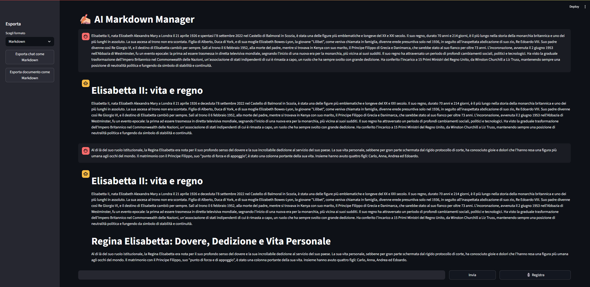

# AI Markdown Manager

**AI Markdown Manager** is an application that allows users to interact, through a Streamlit web app, with intelligent agents specialized in writing Markdown documents. The application is capable of performing the following tasks:
- creating Markdown documents;
- editing documents;
- autonomously organizing text into sections and subsections;
- saving and opening files in Markdown format by providing the full path;
- displaying specific sections or parts of a document;

The Streamlit interface allows users to:
- write prompts to agents and view their responses;
- dictate prompts using the [whisper-base](https://huggingface.co/openai/whisper-base) model, executed locally;
- export the entire conversation or the generated document in the following formats: HTML, PDF, Markdown, and DOCX;

This project was developed as part of the course **"Intelligent Agents and Machine Learning"**, provided by the company [Aitho](https://aitho.it/) at the University of Catania.

The chosen architecture for the project, in line with the course contents, is the **Plan-Execute multi-agent architecture**. In this architecture, the **Planner agent** decomposes the prompt into executable tasks and creates a plan to pass to the **Executor**, which performs the tasks using tools specified by the Planner. Each activity described has a corresponding tool. Except for file opening and saving, the other tools use **reactive agents** specialized in their specific activity (such as text organization).

The entire project uses **Mistral models** via an API key available for free by registering at [https://mistral.ai/](https://mistral.ai/).  
By default, the model used for agents is `mistral-small-latest`.

As a project requirement, a significant portion of the code (more than 50%) was written using **Vibe Coding**. For this purpose, **Gemini 2.5 Pro** was used.

**Development Team**: *Edoardo Tantari and Raffaele Terracino.*

---

## Installation and Execution

To install and run the application, follow these steps:
- Install **Python 3.12** (other versions are not supported due to Pytorch dependencies)
- Install **Poetry** by following the official guide: https://python-poetry.org/docs/
- Run the command `poetry install`
- Copy the `.env.example` file, rename it to `.env`, and insert your Mistral API key in the `MISTRAL_API_KEY` field
- To enable dictation, install **FFMPEG** on your system by following the guide at: https://ffmpeg.org/download.html
- Run the application with the command:  
  `poetry run streamlit run app/app.py`

**Important note**: The first launch of the application might take a few minutes due to initial configurations.

---

## Project Structure

- `app`: contains the Streamlit application to run;
- `src`: contains the Plan-Execute architecture, specifically:
  - `agents.py`: defines agents specialized in markdown-related tasks;
  - `tools.py`: defines the tools to be executed;
  - `nodes.py`: defines the Planner and Executor nodes;
  - `report_manager.py`: class that instantiates the Langchain graph to create the architecture. Contains the `run` method to interact with agents via a prompt;
  - `transcribe.py`: enables usage of the Whisper model for audio transcription;
  - `convert.py`: contains the logic for exporting the chat and document to the mentioned formats.
- `notebook`: contains a sample main file to quickly test the architecture’s functionalities.

---

## Prompting Guidelines

The agents do not have memory of previous commands, only of the current markdown document.  
Therefore, for best results, it's important to **format prompts clearly**, explicitly indicating sections, text to add, and commands.

Examples:
- `"Create a new document with an empty section 'Introduction'";`
- `"In the Introduction section, add the following text: 'Hello! This is my document'";`
- `"In the 'Star Wars' section, generate a list containing all the saga’s movies";`

When opening markdown files, always provide the **full path**, not a relative one.

---

## Usage Example

In the screenshot below, the input is a text about Queen Elizabeth. The agents autonomously organize it into sections. When a second part arrives, the agents first organize it, then append it to the created document.

A complete example of a conversation is available here: [Full Example](examples/esempio_chat.pdf)
